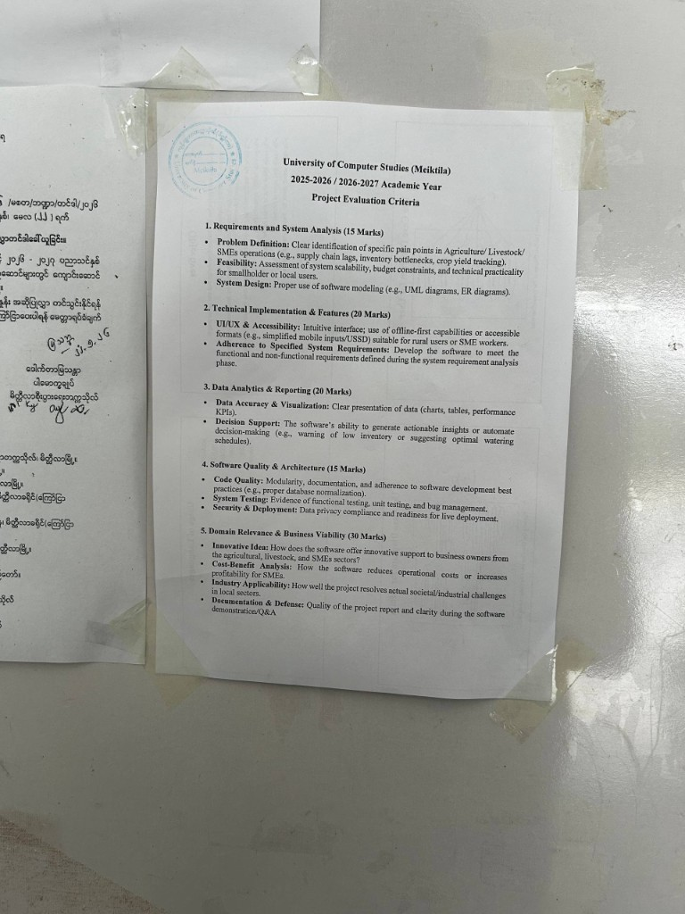

# Smart Agro Community
### Smart Tools for Myanmar Farmers

**A bilingual agricultural intelligence platform that turns a phone photo into a field diagnosis, a trusted advisor into a conversation, and isolated farms into a connected community.**

---

**Project type:** Web application (Progressive Web App)  
**Domain:** AgriTech · Digital inclusion · Climate-smart farming  
**Primary users:** Myanmar farmers, agronomy experts, and platform administrators  
**Languages:** English and Myanmar (မြန်မာ)  
**Tagline:** *Smart Tools for Myanmar Farmers*

---

## Team Members

The project is submitted by the following team from the University of Computer Studies (Meiktila).

| No. | Name | Student ID |
|---|---|---|
| 1 | Mg Arkar Thet Naing | 24-25-UCSMTLA- |
| 2 | Mg Khant Zaw | 24-25-UCSMTLA- |
| 3 | Mg Kaung Myat Tun | 24-25-UCSMTLA- |
| 4 | Mg Yawai Aung | 24-25-UCSMTLA- |

---

## Official Project Evaluation Criteria

The photograph below is the **University of Computer Studies (Meiktila) 2025–2026 / 2026–2027 Academic Year Project Evaluation Criteria**. It is attached as an official source document for this submission.



*Figure 1. Official evaluation criteria (University of Computer Studies, Meiktila).*

Typed transcription of the attached criteria:

| No. | Criterion | Marks | What is assessed |
|---|---|---:|---|
| 1 | Requirements and System Analysis | 15 | Problem definition (agriculture / livestock / SME pain points); feasibility for smallholders; system design (UML, ER). |
| 2 | Technical Implementation & Features | 20 | UI/UX and accessibility for rural users; adherence to the SRS functional and non-functional requirements. |
| 3 | Data Analytics & Reporting | 20 | Accurate charts, tables, and KPIs; decision support (actionable insights and automated recommendations). |
| 4 | Software Quality & Architecture | 15 | Modular code, documentation, testing, security/privacy, and live-deployment readiness. |
| 5 | Domain Relevance & Business Viability | 30 | Innovative support for agricultural SMEs; cost–benefit; local industry applicability; quality of report and defence. |
| | **Total** | **100** | |

### How this submission maps to the criteria

| Criterion | Where it is evidenced in this document |
|---|---|
| 1. Requirements & analysis (15) | Problem Statement (§2); feasibility in Technology Stack (§4); full **Software Requirements Specification** attached as **Appendix A**. |
| 2. Technical implementation (20) | Core Solutions (§3): Detect, BaGyi Pyoe, Community, weather, heatmap, Knowledge Center; bilingual Myanmar-first PWA. |
| 3. Data analytics & reporting (20) | Detection history and bilingual lab reports; outbreak heatmap; weather-linked advice; admin/expert queues. |
| 4. Quality & architecture (15) | Typed Express API, Zod, Helmet/CORS/rate limits, JWT+OTP, Vitest; architecture in §4 and SRS §6–10. |
| 5. Domain & viability (30) | Social Impact (§5); Myanmar crops and DOA protocols. Full SRS attached for documentation defence. |

The complete **SRS v4.1** is attached as **Appendix A** (and as a standalone Word file `SRS-Smart-Agro-Community.docx`).

---

## 1. Executive Summary & Project Vision

Agriculture remains the backbone of Myanmar’s rural economy. Yet the farmer who notices a yellowing leaf at dawn still faces a familiar delay: wait for an extension officer, guess at a pesticide, or lose a season to a disease that could have been named in minutes.

**Smart Agro Community** closes that gap. It is a full-stack, mobile-first web platform that puts three capabilities in one place:

1. **See** — AI disease and pest detection from a field photo, across **19 Myanmar crops**.
2. **Ask** — **BaGyi Pyoe / ဘကြီးပျိုး**, a weather-aware farming chatbot that answers in the farmer’s own language.
3. **Share** — an interactive community where diagnoses, weather, and local experience travel faster than an outbreak.

The vision is not “another dashboard.” It is a **field companion**: Myanmar-first in language and treatment advice, grounded in Department of Agriculture (DOA) field guides, and designed so a farmer on a phone can act the same day.

We built a complete product, not a prototype slide. Detection, chat, community, weather, outbreak mapping, expert review, knowledge resources, and admin moderation are live in the codebase and connected through a single farmer experience.

> **If a farmer can photograph a leaf, they should be able to name the problem, know what to do, and learn from neighbours — in Myanmar, on a phone, today.**

---

## 2. Problem Statement

### 2.1 Delayed diagnosis costs harvests

Crop disease and pest pressure move faster than traditional advisory channels. By the time a farmer reaches a township office or waits for a visit, infection may already be in neighbouring plots. Misidentification leads to the wrong chemical, wasted money, and preventable yield loss.

### 2.2 Advice is fragmented and language-barred

Field knowledge exists — in DOA manuals, in expert heads, in neighbouring farms — but it is not where the farmer is. English-only apps, PDF manuals, and generic global models fail Myanmar’s script, crops, and cropping calendar. A rice blast protocol copied from another country is not a Myanmar paddy protocol.

### 2.3 Isolation during outbreaks

Farmers often discover the same pest in the same week without knowing it is a regional pattern. There is no shared, township-level picture of what is being detected today, and no trusted way to ask “has anyone else seen this?” with a photo and a verified diagnosis attached.

### 2.4 Trust and safety on digital platforms

A community without moderation becomes noise or harm. Reports need a reason, owners need to delete their own posts, and admins need to approve or deny removals with a notice back to the author. Expert review of AI results is equally essential: models assist; agronomists confirm.

**Smart Agro Community is built for these four problems together** — diagnosis, advice, community signal, and accountable review — rather than as disconnected tools.

---

## 3. Core Solutions

The platform is organised around three pillars requested by this competition, implemented as they exist in the product today.

### 3.1 AI Detection — from photo to field protocol

**What the farmer does:** Opens Detect, optionally sets township or GPS, uploads a clear photo of a leaf, stem, fruit, or pest damage (JPEG / PNG / WebP, up to 5 MB), and receives a structured result.

**What the system does:**

| Capability | Implementation in product |
|---|---|
| Multi-crop recognition | **19 field crops:** Rice, Black Gram, Green Gram, Pigeon Pea, Sesame, Groundnut, Sunflower, Maize, Rubber, Sugarcane, Cotton, Cabbage, Onion, Garlic, Chili, Potato, Tea, Coffee, Oil Palm |
| Disease & pest catalog | Canonical English labels plus Myanmar names; hundreds of unique problems including **Healthy** |
| Vision pipeline | **Google Gemini** vision as primary (with API-key rotation on quota); **Cursor** as fallback; optional local **scikit-learn SVM** rice model (HSV + HOG + LBP + GLCM) |
| Quality gate | Rejects non-crop / non-leaf-like images rather than inventing a disease |
| Result card | Crop, disease (Myanmar-first), confidence, severity (Mild → Critical), ranked alternatives |
| Treatment | DOA Myanmar field protocols (cotton, pulses, oilseeds, **pepper/chili**, rice IPM) preferred over generic AI text |
| Expert loop | Farmer can **request expert review**; experts/admins **verify, correct, or reject** with a reason; farmer receives a notice |
| Lab report | Downloadable **bilingual .docx** laboratory-style report (Myanmar before English) |
| Outbreak signal | Each detection can carry location and weather context and feed the **community heatmap** |

Detection is not a black box. The farmer sees confidence, can expand a full treatment guide (symptoms, cultural control, recommended chemistry with label-use caution), share to Community, or ask an expert. That is how AI earns trust in the field.

### 3.2 AI Chatbot — BaGyi Pyoe / ဘကြီးပျိုး

The assistant is not a generic “bot.” It is a named field elder:

- **English:** BaGyi Pyoe  
- **Myanmar:** ဘကြီးပျိုး  

The name is intentional: a trusted uncle who raises seedlings — warm, practical, never a cold chatbot brand.

**What it does in the product:**

- Answers in **the same language the farmer uses** (English or Myanmar).
- Knows the **supported crop list** and crop-specific disease/pest problems.
- Receives **live weather context** (temperature, humidity, rain, alerts) for the farmer’s township or GPS point and must use those numbers — not invent Yangon weather.
- Ties weather to risk (e.g. humidity + rain → fungal pressure; stagnant water + high nitrogen → planthopper).
- Prefers **IPM**: scouting, sanitation, resistant varieties; does not invent unverified brand dosages.
- Saves **chat history** for signed-in users; guests can try the advisor without an account.
- Offers quick suggestions (blast care, pest IPM, local forecast).

This is agricultural decision support, not entertainment chat: short steps, what to check in the field today, and when to open Detect or Weather instead of guessing.

### 3.3 Interactive Community — learn together, stay safe

Community is a social layer built for farms, not for generic social media.

**Feed**

- Field posts with text and photos; optional **link to a verified diagnosis**.
- Likes, comments, and nested replies.
- Save posts locally; add friend / message the author from the card.
- Author can **delete their own post**.
- Others can **report a post with a structured reason** (spam, harassment, false information, inappropriate, other + details).

**Trust & moderation**

- Reports go to **admins** (inbox + Community moderation queue).
- Admin **approves** (deletes the post; author receives a notice **with the deletion reason**) or **denies** (post stays).
- Hide / restore remains available for broader moderation.
- Farmers can appeal certain notices.

**Beyond the feed**

- **Messages:** one-to-one and group chats, friend requests, invite links.
- **Profiles:** farm crops, township, bio, own posts.
- **Knowledge Center:** books, articles, and journals for practical reading.
- **Weather:** Open-Meteo current conditions and 7-day forecast, township search, GPS, crop-related tips.
- **Outbreak heatmap:** Leaflet choropleth + heat layer of community detections across Myanmar townships and regions.
- **Roles:** Farmer · Expert · Admin — experts review diagnoses; admins run users, knowledge, moderation, and audit.

Together, Community turns a private scan into public early warning — with the safeguards a public agricultural network requires.

---

## 4. Technology Stack

The stack below is what the repository actually runs — not a hypothetical architecture.

### 4.1 Client (farmer & staff web app)

| Layer | Technology |
|---|---|
| UI | **React 19**, **TypeScript**, **React Router 7** |
| Build | **Vite 6**, **@vitejs/plugin-react** |
| Installable app | **vite-plugin-pwa** (Workbox, standalone manifest: *Smart Agro Community*) |
| Maps | **Leaflet**, **leaflet.heat**, Myanmar GeoJSON boundaries |
| Documents | **docx** (client-generated lab reports) |
| i18n | First-class **English / Myanmar** copy, Myanmar numerals, Padauk & Noto Sans Myanmar |
| Styling | Custom design system (mobile-first, Myanmar line-height and wrap rules) |

### 4.2 API server

| Layer | Technology |
|---|---|
| Runtime | **Node.js**, **Express 4**, **TypeScript** (**tsx** in development) |
| Database | **MongoDB** via **Mongoose 8** |
| Files | **GridFS** (default); S3-ready configuration |
| Auth | **JWT** access + refresh, **bcryptjs**, OTP rate limits |
| Validation | **Zod** on request bodies |
| Security | **Helmet**, **CORS**, **express-rate-limit**, magic-number checks on uploads (**file-type**, **multer**) |
| Mail | **Nodemailer** |
| Tests | **Vitest**, **Supertest**, **mongodb-memory-server** |

**API surface (representative):** `/auth`, `/detections`, `/chatbot`, `/social`, `/messages`, `/weather`, `/heatmap`, `/knowledge`, `/admin`, `/files`.

### 4.3 Intelligence layer

| Layer | Technology |
|---|---|
| Primary vision & chat | **Google Gemini** (configurable model, e.g. Gemini 3.6 Flash; multi-key rotation) |
| Fallback LLM / agent | **Cursor SDK** (`@cursor/sdk`) |
| Local rice model (optional) | **Python FastAPI** service — **OpenCV**, **Pillow**, **scikit-learn SVM**, **scikit-image** (HOG / LBP / GLCM) |
| Weather | **Open-Meteo** forecast + geocoding (Myanmar-restricted search) |
| Field knowledge | Curated **DOA Myanmar** treatment catalog mapped to detect labels |

### 4.4 Architecture in one sentence

A **React PWA** talks to a **typed Express API** on MongoDB; Gemini (with Cursor fallback) diagnoses photos and powers BaGyi Pyoe; Open-Meteo grounds advice in real township weather; DOA protocols and expert review keep recommendations accountable.

```
[ Phone / Browser PWA ]
        │
        ▼
[ Vite + React + TypeScript ]
        │  /api/v1
        ▼
[ Express + JWT + Zod + Helmet ]
        │
        ├── MongoDB + GridFS
        ├── Gemini vision & chat ──► Cursor fallback
        ├── FastAPI rice SVM (optional)
        └── Open-Meteo + DOA field guides
```

---

## 5. Social Impact & Future Roadmap

### 5.1 Who benefits

| Stakeholder | Impact |
|---|---|
| **Smallholder farmers** | Same-day, Myanmar-language diagnosis and IPM steps without waiting for a distant office |
| **Women and youth on farms** | Phone-first access; no requirement for English literacy |
| **Extension / experts** | A queue of real photos and cases instead of unstructured chat rumours |
| **Townships & DOA-aligned practice** | Advice drawn from national field guides, not anonymous internet recipes |
| **Communities** | Heatmap and feed make outbreaks visible while they can still be contained |

### 5.2 Why this is more than an app

Food security in Myanmar is a field problem: humidity, monsoon timing, seed quality, and neighbour-to-neighbour spread. Digital tools fail when they ignore language, local crops, and trust. Smart Agro Community is **localised by design** — 19 crops that are actually grown here, Myanmar-first UI and reports, township weather, and a character (ဘကြီးပျိုး) farmers can talk to as an elder, not as a vendor.

Responsible AI is built in: quality gates, confidence scores, expert override, pesticide-label caution, and community reporting with human approval before a post is deleted.

### 5.3 Alignment with competition values

- **Innovation:** Multi-crop vision + weather-aware chat + outbreak map in one bilingual PWA.  
- **Feasibility:** Running MERN-style stack, real APIs, PWA install, and documented local services.  
- **Inclusion:** Myanmar script, digits, and DOA protocols; guest try-before-register for chat.  
- **Sustainability:** IPM-first advice reduces panic spraying; community signal reduces duplicate loss.  
- **Scalability:** Crop catalog and treatment maps are data, not hardcoded one-crop logic.

### 5.4 Future roadmap

**Near term**

- More DOA crop manuals in the treatment catalog (vegetables, plantation crops).  
- Offline-friendly caching of saved reports and recently viewed guides.  
- Stronger push notifications for outbreak clusters in the farmer’s township.

**Medium term**

- On-device or edge models for rice and chili where connectivity is weak.  
- Partnership pilots with township agriculture offices using the expert-review queue.  
- Voice input for BaGyi Pyoe for low-literacy users.

**Long term**

- Seasonal risk forecasts combining heatmap history + weather.  
- Open data dashboards for researchers (privacy-preserving, township-level).  
- A national early-warning layer: when many farmers scan the same pest, the map speaks before the crop fails.

---

## Closing statement

Smart Agro Community is a working answer to a simple, urgent question:

**When a leaf changes colour in a Myanmar field, how fast can the farmer know, act, and warn the next farm?**

We built the camera, the advisor, and the community so that answer can be: *this morning.*

We respectfully submit **Smart Agro Community** for your consideration — a complete, bilingual, field-ready platform worthy of first place.

---

**Smart Agro Community**  
*Smart Tools for Myanmar Farmers*  
© 2026 · Built for Myanmar farms

---

## Appendix A — Software Requirements Specification (full text)

The authoritative SRS is kept in [`SRS-Smart-Agro-Community.md`](SRS-Smart-Agro-Community.md) and is generated as Word in [`SRS-Smart-Agro-Community.docx`](SRS-Smart-Agro-Community.docx). The competition Word proposal embeds the **complete SRS text** after the closing statement so evaluators do not need a separate upload.
